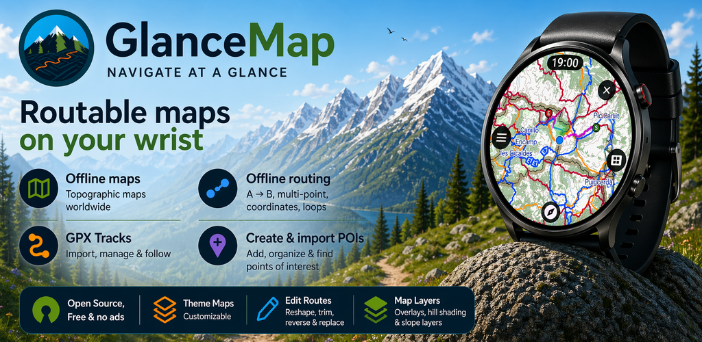
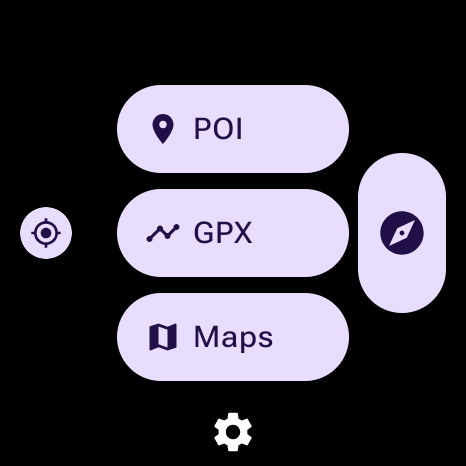
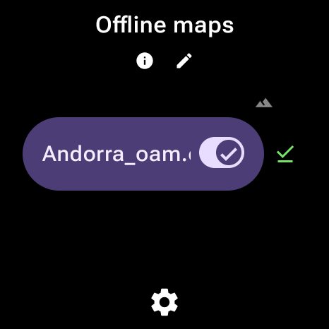
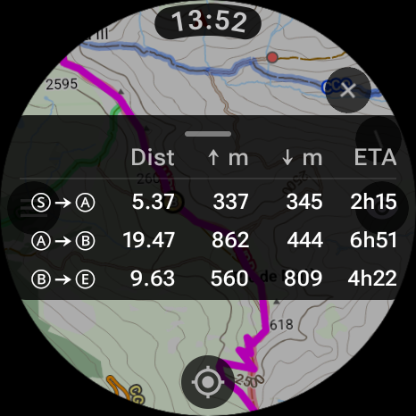
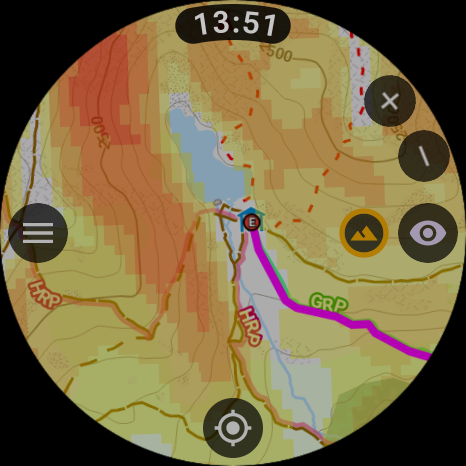

# GlanceMap

GlanceMap is a Wear OS navigation app with an Android companion app for file transfer and sync.

## Screenshots

  
  

  
  

## Highlights

- Offline maps on your Wear OS watch
- GPX import, management, and route following
- Offline routing with A -> B, multi-point, coordinates, and loop workflows
- POI import, organization, and lookup on the watch
- Multiple map themes with overlays, hill shading, and slope overlay support
- Android companion app for transfer, sync, and download workflows
- Open source, no ads, and no account required

## Why GlanceMap?

GlanceMap exists to bring offline topographic navigation to Android watches,
where the current Play Store offering is still limited despite modern Wear OS
hardware being capable of running proven open-source building blocks such as
[Mapsforge](https://github.com/mapsforge/mapsforge) and
[BRouter](https://github.com/abrensch/brouter), together with free topographic
map sources like [OpenAndroMaps](https://www.openandromaps.org/) and
[OpenHiking](https://www.openhiking.eu/en/downloads/mapsforge-maps), plus
multiple map themes.

The app is not designed to be an activity recorder. Instead, it is meant to
work alongside the recording features of your watch or another sports app while
staying focused on maps, routing, GPX use, and POI workflows. That separation
also helps battery life: screen usage and GPS are among the biggest drains on a
watch, so GlanceMap is built around using those features when you actively look
at the watch rather than trying to behave like a full-time tracking recorder.

## Components

- `:app` - Wear OS navigation app
- `:glancemapcompanionapp` - Android companion app
- `:transfercontract` - Shared phone/watch transfer protocol module

## License And Third-Party Assets

The root `LICENSE` covers GlanceMap project code unless another file says
otherwise. Bundled map themes, icons, vendored code, and service/API notes are
tracked under `licenses/` and `third_party/`. Review
[Compliance Status](licenses/COMPLIANCE_STATUS.md) before any public repository
or app release.

## Roadmap / Planned Features

## Documentation

- [Architecture index](docs/architecture/README.md)
- [Wear navigation](docs/architecture/wear-navigation.md)
- [Wear location service](docs/architecture/wear-location-service.md)
- [Wear transfer service](docs/architecture/wear-transfer-service.md)
- [Location module architecture](docs/location/ARCHITECTURE.md)
- [Location contribution guide](docs/location/CONTRIBUTING.md)
- [Location threshold rationale](docs/location/THRESHOLDS.md)
- [Compass module architecture](docs/compass/ARCHITECTURE.md)
- [Compass contribution guide](docs/compass/CONTRIBUTING.md)
- [Compass threshold rationale](docs/compass/THRESHOLDS.md)
- [Public repository checklist](docs/PUBLIC_REPO_CHECKLIST.md)
- [Google Play privacy checklist](docs/GOOGLE_PLAY_RELEASE_PRIVACY_CHECKLIST.md)
- [Privacy policy page source](docs/privacy-policy.md)
- [License and attribution notes](licenses/README.md)

## Privacy Policy

- [Public privacy policy](https://adriengrp.github.io/GlanceMap/privacy-policy/)

## Contributing

See [Contributing](CONTRIBUTING.md) for setup, workflow, and PR expectations.
